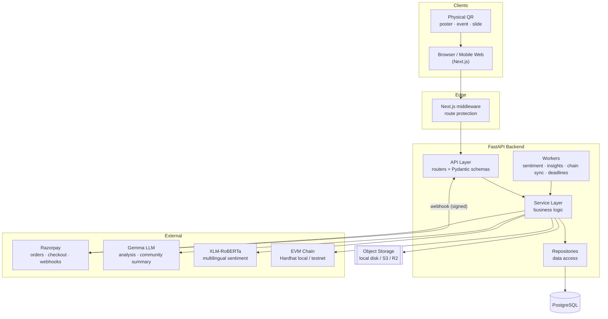
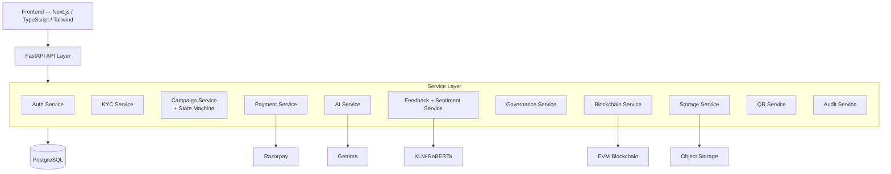
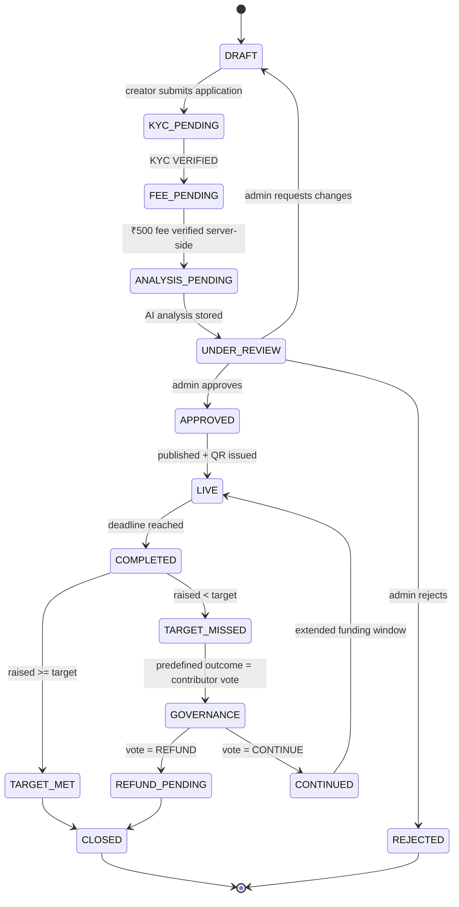
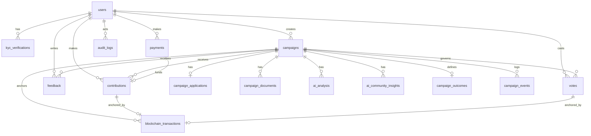
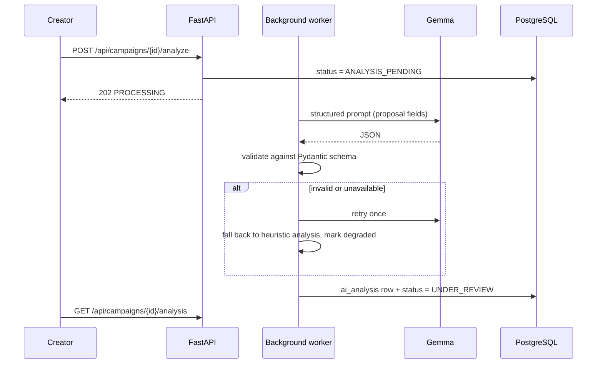
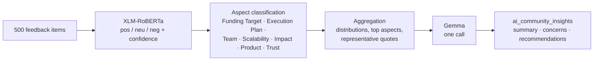
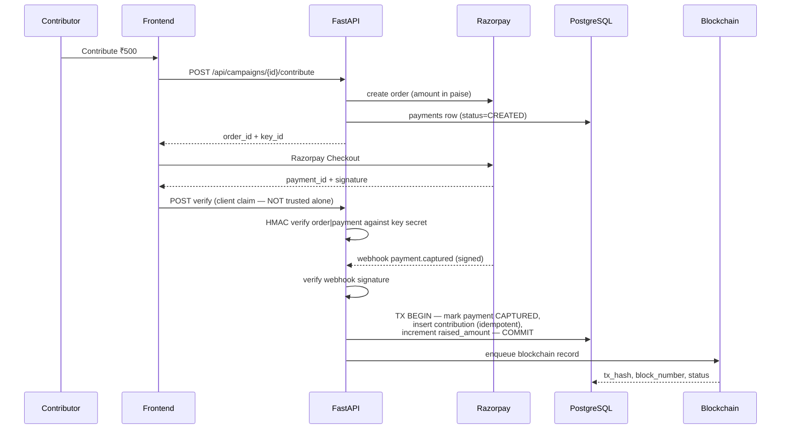
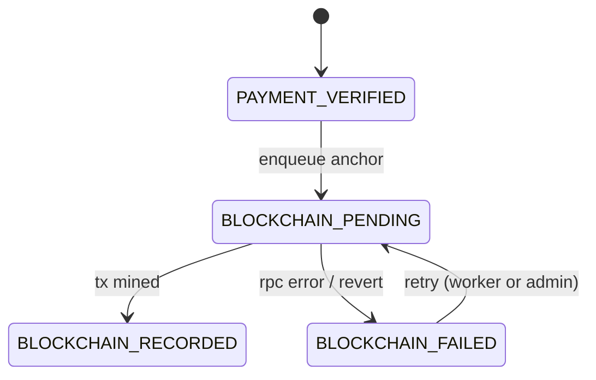
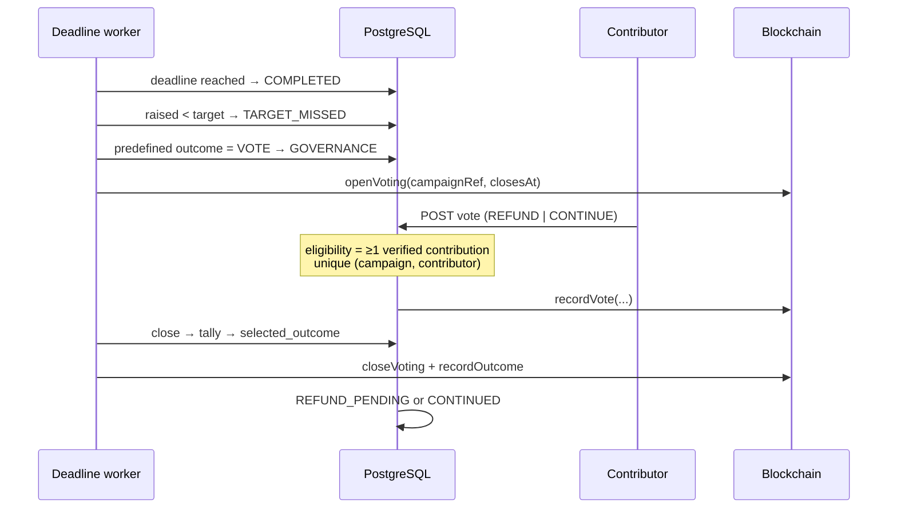
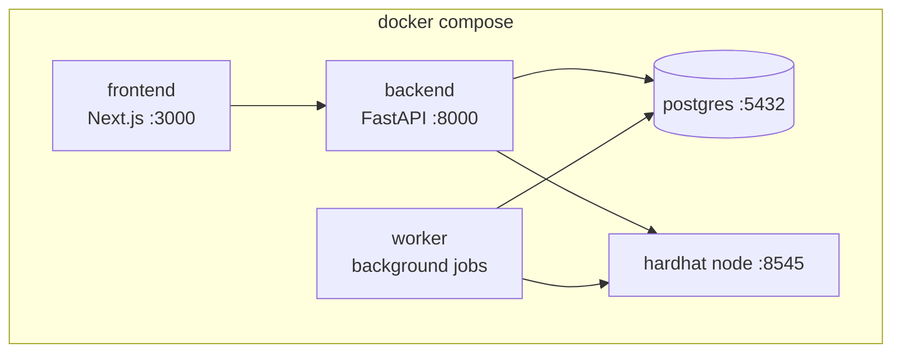

# CrowdWise — Architecture

**CrowdWise — AI-Powered Community Crowdfunding & Governance Platform**
*Smarter Crowdfunding. Stronger Communities.*

This document is the High Level Design (HLD) and the detailed component architecture
for CrowdWise. It covers: system architecture, component architecture, API
architecture, database architecture, AI architecture, payment architecture,
blockchain architecture, security architecture, and deployment architecture.

---

## 1. Design thesis

Most crowdfunding platforms model the domain as:

```
campaign → payment → money raised
```

CrowdWise models it as a **governed community lifecycle**. A campaign is a proposal
that must earn the right to exist (KYC, application fee, AI evaluation, human
review), that the community can *evaluate* (feedback, ratings, sentiment, aspect
analysis, AI community intelligence), and whose *ending* is decided by predefined
rules and, when the target is missed, by the contributors themselves (governance
vote), with a tamper-resistant record of the important moments.

Four separations of concern hold the design together:

| Concern | System of record | Never the system of record |
|---|---|---|
| Money (INR) | Razorpay + settlement infrastructure | blockchain, frontend, QR |
| Application state | PostgreSQL | blockchain |
| Tamper-evidence of key events | Blockchain (EVM) | PostgreSQL |
| Judgement / approval | Human admin | AI |

AI is decision support. Blockchain is an audit surface. Razorpay is the money.
PostgreSQL is the truth of the application.

---

## 2. System architecture



### Request lifecycle

1. Next.js middleware checks the session cookie and role for protected routes.
2. The browser calls FastAPI with `credentials: "include"` (HTTP-only cookie).
3. Middleware assigns a request id, binds structured logging context, applies rate
   limits on sensitive endpoints.
4. The router validates input with Pydantic and resolves the current user + role.
5. The service performs the business operation in a DB transaction and writes audit
   records.
6. Expensive work (LLM, sentiment, chain) is dispatched to a background task; the
   response returns a `PROCESSING` state that the UI polls.

---

## 3. Component architecture (HLD)



Every outward-facing integration sits behind a provider interface with at least two
implementations — a real one and a demo/mock one selected by environment variable:

| Interface | Real | Demo |
|---|---|---|
| `KYCProvider` | (pluggable real provider) | `DemoKYCProvider` |
| `PaymentProvider` | `RazorpayPaymentService` | `DemoPaymentService` |
| `CampaignAnalysisProvider` | `GemmaProvider` | `MockAnalysisProvider` |
| `SentimentProvider` | `XLMRobertaProvider` | `MockSentimentProvider` |
| `BlockchainProvider` | `Web3ChainProvider` | `MockChainProvider` |
| `StorageProvider` | `S3StorageProvider` | `LocalStorageProvider` |

This is what lets the whole hackathon demo run offline with no credentials, and what
lets production swap in real providers without touching business logic.

---

## 4. The campaign lifecycle



Transitions are enumerated in code. An API request cannot set an arbitrary status;
it can only *request an operation* whose service performs a legal transition. Illegal
transitions raise `InvalidTransitionError` → HTTP 409.

---

## 5. API architecture

REST over JSON, cookie-authenticated, documented automatically at `/docs` and
`/redoc`. Routers are grouped by OpenAPI tag:

`Auth` · `KYC` · `Campaigns` · `Public` · `Payments` · `Contributions` ·
`Feedback` · `AI` · `Governance` · `Blockchain` · `Admin`

Principles:

- Routers are thin: validate → authorize → delegate → serialize.
- Request and response models are Pydantic schemas; ORM models never leave the
  service layer.
- Errors use one envelope: `{"error": {"code", "message", "details"}}`.
- Public endpoints (`/api/public/*`) return a redacted campaign projection — no
  creator email/phone, no KYC, no payment identifiers.
- Write endpoints that touch money or governance accept an idempotency key or derive
  one deterministically (Razorpay order id, event id, `(campaign, contributor)` pair).

Full endpoint reference: [`docs/api.md`](./api.md).

---

## 6. Database architecture

PostgreSQL via SQLAlchemy 2.0 + Alembic migrations.



Key modelling decisions:

- **Money** is `Numeric(14, 2)` in rupees. Paise integers exist only at the Razorpay
  boundary. This avoids float drift and avoids leaking a payment-gateway detail into
  the domain model.
- **`campaigns.public_id`** (`CMP-N2R6YW`, a Crockford-base32 digest of the title) is the stable external identifier used in
  public URLs, QR payloads, and as the on-chain campaign reference. Internal integer
  ids never appear in public URLs.
- **`payments` is separate from `contributions`.** A payment is a gateway fact; a
  contribution is a domain fact created only after that payment is verified. This is
  what makes "raised amount only moves after verification" structurally true rather
  than a convention.
- **Uniqueness constraints carry the business rules**: one vote per contributor per
  campaign governance round; one contribution per Razorpay payment id; one payment
  row per Razorpay order id.
- **`campaign_events` vs `audit_logs`**: events are the campaign's public timeline;
  audit logs are the platform-wide actor-oriented record for admins.
- Indexes on every FK, on `campaigns(status, approval_status)`, `campaigns(slug)`,
  `campaigns(public_id)`, `payments(razorpay_order_id)`,
  `payments(razorpay_payment_id)`, `feedback(campaign_id, created_at)`,
  `contributions(campaign_id, created_at)`.

---

## 7. AI architecture

Two distinct AI surfaces, deliberately kept apart.

### 7.1 Campaign analysis (Gemma)

Runs once per campaign submission (retryable). Input is the *creator-authored
proposal only* — no contributor data, no personal data.



Output is a strict schema: `feasibility_score`, `problem_clarity_score`,
`impact_score`, `risk_score` (0–100) plus `strengths[]`, `concerns[]`,
`recommendations[]`. The model is never allowed to define its own structure — output
is parsed and validated, and a failure degrades to a deterministic fallback rather
than corrupting the record.

Every AI surface in the UI renders the disclaimer:

> AI analysis is provided as decision support and is not a guarantee of campaign
> success or legitimacy.

### 7.2 Community intelligence (XLM-RoBERTa → aggregate → Gemma)

The cost-control shape matters: individual feedback items go to the *cheap*
multilingual classifier; only **aggregates and a small representative sample** go to
the LLM.



Rules:

- Sentiment is computed **when feedback is created** (background task), never on
  dashboard render.
- Community insights are **cached** and only regenerated when enough new feedback has
  arrived or an explicit refresh is requested.
- No contributor identity is sent to the LLM — only anonymised text aggregates.

### 7.3 Campaign health

`CrowdWise Campaign Health` is a transparent weighted blend, computed in code (not by
the LLM), of financial signals (funding %, velocity, contributor count, average
contribution, days remaining), community signals (rating, feedback volume, sentiment,
engagement), and AI signals (risk, feasibility). It is explicitly **not** a
prediction of financial success and is labelled as such in the UI.

---

## 8. Payment architecture



The two verification paths (client callback + webhook) converge on the *same*
idempotent function. Whichever arrives first performs the state change; the second is
a no-op. The webhook is authoritative: a client callback alone never creates a
contribution without a valid HMAC signature, and a captured webhook creates the
contribution even if the browser was closed.

### Money flow reality

```
Contributor → Razorpay → settlement infrastructure → beneficiary account structure
```

The QR does not hold money. The blockchain does not hold INR. For the hackathon,
Razorpay Test Mode is used and the backend records the payment, the contribution, and
the campaign totals. Payout/marketplace distribution sits behind the same
`PaymentProvider` abstraction so a linked-account flow can be added without touching
domain logic. Refunds are `PaymentService.refund()` — never a Solidity function.

---

## 9. Blockchain architecture

A single small, audit-friendly contract: `CrowdWiseRegistry.sol`.

```solidity
registerCampaign(bytes32 campaignRef, uint256 targetAmount)
recordContribution(bytes32 campaignRef, bytes32 paymentRefHash, uint256 amount, address contributor)
openVoting(bytes32 campaignRef, uint64 closesAt)
recordVote(bytes32 campaignRef, bytes32 voterRef, uint8 choice, uint256 weight)
closeVoting(bytes32 campaignRef)
recordOutcome(bytes32 campaignRef, uint8 outcome)
getCampaign / getContribution / getVote
```

Events: `CampaignRegistered`, `ContributionRecorded`, `VoteRecorded`,
`VotingOpened`, `VotingClosed`, `OutcomeRecorded`.

### What goes on-chain — and what never does

| On-chain | Off-chain (PostgreSQL only) |
|---|---|
| campaign reference hash | name, email, phone |
| contribution amount | KYC data, PAN, address, bank details |
| timestamp | Razorpay payment/order ids (only a salted hash goes on-chain) |
| payment reference **hash** | feedback author identity |
| opaque voter reference | vote-to-person mapping |
| vote choice + weight | |

### Failure isolation



A verified payment is **never** marked failed because the chain was unreachable. The
contribution is real, funded, and counted; only its anchor is pending. The UI shows
this honestly rather than hiding it.

---

## 10. Governance architecture

Governance opens only when a campaign completes below target **and** the campaign's
predefined outcome configuration says contributors decide. The available outcomes are
fixed *before contributions begin* and cannot be changed once voting opens.



Eligibility rule (MVP): a contributor with at least one verified contribution.
Weighting is configurable per campaign — default is **one contributor, one vote**;
contribution-weighted voting is supported by the same code path. Rejected at the
service layer: duplicate votes, non-contributor votes, votes after close, votes on a
campaign not in `GOVERNANCE`.

`REFUND_PENDING` means exactly what it says: the refund is being processed by payment
infrastructure. No blockchain transaction is described as having refunded rupees.

---

## 11. Security architecture

| Control | Implementation |
|---|---|
| Password storage | bcrypt with per-password salt; plaintext never stored or logged |
| Session | JWT in `HttpOnly`, `SameSite=Lax`, `Secure` (prod) cookie; short access + refresh strategy |
| Authorization | role dependency (`require_role`) plus per-object ownership checks |
| CSRF | SameSite cookies + double-submit token on state-changing form posts |
| CORS | explicit origin allowlist from env; credentials enabled only for that origin |
| Rate limiting | per-IP + per-account on auth, payment, and feedback endpoints |
| Input validation | Pydantic (backend) + Zod (frontend); ORM parameterisation prevents SQLi |
| File upload | MIME sniff + extension allowlist + size cap + randomised storage key; original filename never used on disk |
| Webhooks | HMAC-SHA256 signature verification before any parsing of the body |
| Payments | server-side signature verification; client success never mutates money state |
| Idempotency | unique constraints + deterministic keys on webhook, contribution, vote, anchor |
| Secrets | environment only; `.env` git-ignored; `.env.example` has placeholders |
| Logging | structured, with request id and user id; never passwords, secrets, private keys, or KYC payloads |
| Data privacy | sensitive PII never leaves PostgreSQL; never sent on-chain or to the LLM |

---

## 12. Observability

Every request logs: request id, user id (when authenticated), method, path, status,
duration. Every external integration logs attempt, outcome, and latency — Razorpay
webhooks additionally log event id, payment id, event type, and processing status, so
duplicate deliveries are visible in the log as well as blocked in the database.

---

## 13. Deployment architecture



- One command brings up development infrastructure: `docker compose up --build`.
- Health checks on postgres, backend (`/health`), and the hardhat node; the backend
  waits for a healthy database before running.
- Migrations are explicit (`alembic upgrade head`) — application startup never
  silently alters a production schema.
- Production path: managed Postgres, object storage on S3/R2, Razorpay live keys, a
  hosted Gemma endpoint, and a public EVM testnet/mainnet RPC — all reached by
  changing environment variables, not code.

---

## 14. Deliberate non-goals

No token, no NFT, no speculative tokenomics, no custom wallet, no DAO framework, no
INR on-chain, no microservices, no Kubernetes, no ML training pipeline, no in-house
KYC model, no in-house payment processor. Each of these would trade lifecycle
completeness for surface area.
